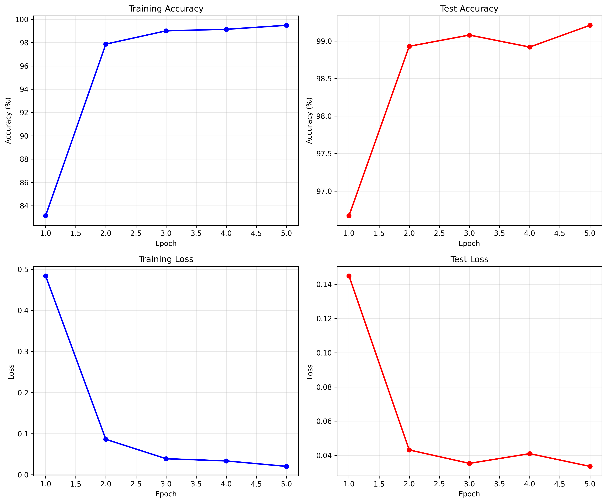

# VGG11 MNIST Benchmark

Training and evaluation of VGG11 architecture on MNIST dataset with generalization testing.

## Architecture

VGG11 with batch normalization adapted for MNIST:
- Input: 1×32×32 (MNIST resized from 28×28 to 32×32)
- 5 convolutional blocks with max-pooling
- 3 fully connected layers with dropout (0.5)
- Output: 10 classes
- Loss: Cross-entropy

The resize to 32×32 is necessary because VGG11 has 5 max-pooling layers (stride 2), requiring input dimensions divisible by 2^5=32. The architecture reduces spatial dimensions: 32→16→8→4→2→1.

## Setup

```bash
# Create and activate virtual environment
python3 -m venv venv
source venv/bin/activate

# Install dependencies
pip install -r requirements.txt
```

## Running Experiments

Run individually:

```bash
# Train baseline model (5 epochs)
python3 train.py

# Generate training plots
python3 plot_training.py

# Test generalization (flips and noise)
python3 test_generalization.py

# Train with data augmentation
python3 train_augmented.py
```

## Results

### Baseline Model Performance
- **Final Test Accuracy**: 99.21%
- **Training**: 5 epochs on 60,000 MNIST samples
- **Optimizer**: Adam (lr=0.001), StepLR scheduler (γ=0.5, step=2)
- **Device**: NVIDIA GeForce RTX 3060

### Training Visualization



The plots show:
- **Training accuracy** reaches 99.48% with steady improvement
- **Test accuracy** peaks at 99.21%, showing slight overfitting in epoch 4
- **Training loss** decreases smoothly from 0.48 to 0.02
- **Test loss** stabilizes around 0.03-0.04 after initial drop

### Generalization Testing

**Flip Tests** (Baseline Model):
- Horizontal flip: 37.22% (↓62% from baseline)
- Vertical flip: 40.06% (↓59% from baseline)
- **Cause**: MNIST digits have orientation-dependent meanings (e.g., 6↔9)

**Gaussian Noise Tests**:
| Model | Baseline | σ²=0.01 | σ²=0.1 | σ²=1.0 |
|-------|----------|---------|--------|--------|
| **Baseline** | 99.21% | 99.20% | 98.81% | 53.60% |
| **Augmented** | 99.54% | 99.39% | 96.82% | 53.32% |

- Low noise (σ²=0.01): Minimal impact on both models
- Medium noise (σ²=0.1): Augmented model more robust (96.82% vs 98.81%)
- High noise (σ²=1.0): Both models degrade significantly (~53%)

### Data Augmentation Results
- **Final Test Accuracy**: 99.54% (↑0.33% from baseline)
- **Augmentations**: Random rotation (±10°), random translation (±10%)
- **Benefit**: Better generalization to medium noise levels, improved overall accuracy
